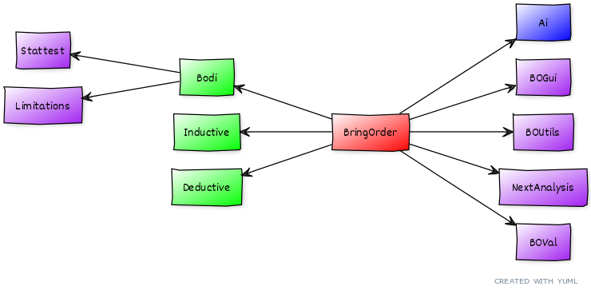

# Software Architecture

## Overview
The code base has been divided into several classes that have their own methods and purposes.
The main class is `BringOrder` and it takes the execution forward by calling other classes.
Data analysis starts with data import that is handled by the `Bodi` class and followed by either hypothesis testing or explorative analysis. The `Deductive` class takes care of the former and the `Inductive` class of the latter. The hypothesis testing or the explorative analysis is finalize by `NextAnalysis` class, which performs the final steps or start a new analysis. 

The `Bodi` class depends on `Limitations`- and `Stattest`-classes. `Limitations` manages data limitations throughout the data-analysis. `Stattest` class is used to perform some statistical tests on the data under examination. The `BOVal` class handles the validation of text inputs and the`Ai` class works as an interface with openAI.
All these classes depend on the `BOGui` class that consists of general methods for creating Jupyter widgets and the `BOUtils` class that has methods for executing Javascript inside Jupyter Notebook.

## Class Diagram
In this simple class diagram of BringOrder, the main class is coloured red, classes handling the analysis phases are green, support classes are purple and interface class is blue.

More detailed class diagrams:

- [Class diagram with functions](./pictures/classdiag_with_functions.png)
- [Full Class diagram with class variables and functions](./pictures/classdiag_with_functions.png)

## Class Detail

### BringOrder
Creating a [BringOrder](https://github.com/Order-Team/bring-order/blob/main/bring_order/bringorder.py) object inside Jupyter Notebook launches a graphical user interface that takes data analysis forward step by step. This class initializes bringorder and contains the main loop which takes care of program execution.

### Bodi
The [Bodi](https://github.com/Order-Team/bring-order/blob/main/bring_order/bodi.py) class begin the analysis by collecting the basic information of the study, importing the data that is going to be examined, loads the config-file (bringorder.cfg, optional) and checking data limitations.

### Deductive
The [Deductive](https://github.com/Order-Team/bring-order/blob/main/bring_order/deductive.py) class guides user through the hypothesis testing.

### Inductive
The [Inductive](https://github.com/Order-Team/bring-order/blob/main/bring_order/inductive.py) class guides user through the explorative analysis.

### Ai
The Ai class is an interface to [openAI](https://openai.com/about) and also handles ui for using openAI. BringOrder creates Ai object and shares it with Bodi, Deductive and Inductive classes.

### BOGui
The [BOGui](https://github.com/Order-Team/bring-order/blob/main/bring_order/bogui.py) class has methods for creating customized Jupyter widgets, such as buttons and input fields, that the user can interact with.
The implementation is based on the [ipywidgets](https://ipywidgets.readthedocs.io/en/stable/) package.
A BOGui object is created automatically with a BringOrder object and then shared with all the Bodi, Deductive, Inductive, Ai, NextAnalysis, Limitations and Stattest objects.

### BOUtils
The [BOUtils](https://github.com/Order-Team/bring-order/blob/main/bring_order/boutils.py) class consists of methods that run Javascript inside Jupyter Notebook. They are used to, for example, create, run, and delete code and Markdown cells.
A BOUtils object is also created automatically with a BringOrder object and shared with other created objects.

### BOVal
The BOVal class is used to validate text inputs through the analysis. It checks that the input fields are not left blank and certain special characters are not used. In Deductive class it is also used to check sentence structure using language model en_core_web_sm-3.6.0.

### NextAnalysis
The NextAnalysis phase is carried out after Deductive or Inductive analysis.

### Stattest
This class handles some statistical testing for imported data. It checks the normal distribution of numerical data and independency of categorical variables.

## Decription of functionality

- [Sequence diagram of initialization](./pictures/BO_init_seqdiag.png)
- [Sequence diagram of Bodi](./pictures/BO_Bodi_seqdiag.png)
- [Sequence diagram of the mainloop in BringOrder](./pictures/BO_mainloop_seqdiag.png)
