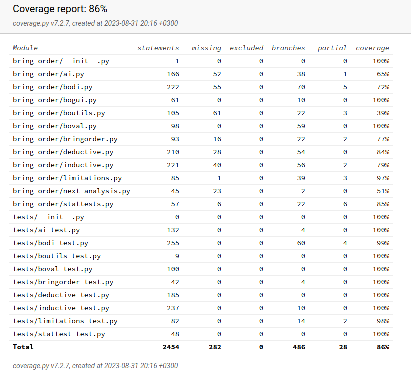

# Testing report

## Introduction

This report describes the testing process of the BringOrder project. The project uses the Pytest framework for creating and running unit tests, the Playwright framework for automated testing, and Pylint for style checking. Also, manual testing is carried out.

## Dependencies

The project uses the following testing dependencies:

    - Pytest
    - Coverage
    - Playwright
    - Pylint

These dependencies are listed as development dependencies in the Poetry project file (pyproject.toml).

## System testing

The package installation was tested on Linux, Windows, and Mac systems.  The package was installed according to the installation guide ([README](https://github.com/Order-Team/bring-order/blob/main/README.md)) on Linux (Cubbli (Common Ubuntu-based Linux), Mint, and OpenSuse tumbleweed) and Windows (Win 10 and Win 11) systems.

The package was also installed on OS X 10.10 but with some installation problems. These kinds of installation problems were not encountered on Windows or Linux systems. This may be due to the fact that used OS X system was really out of date.

Installation guide for macOS based on [PyPa guide](https://packaging.python.org/en/latest/tutorials/installing-packages/#installing-from-pypi). It has not been possible to correct the installation guide, because computer with MacOS was not available and testing on more modern system versions was not possible.

The application works on all tested operating systems.

## Testing Structure

All test files are located in the __tests__ folder. This folder also contains necessary data and configuration files.

### Unit tests

Unit testing of the application is performed using the Pytest framework. Testing currently covers all parts of the applications except the user interface and the Boutils class methods which includes JavaScript. Test coverage is currently 86%.




### Automated testing

The user interface of the application has been tested with the Playwright test. At the beginning of the project, the Robot Framework was used for automated testing. The Robot Framework has been changed to Playwright because Jupyter Notebook cells and widgets do not have a permanent ID or other locator identifiers. 

The tests are divided into data import testing, test hypothesis workflow testing, and exploratory analysis workflow testing.

Most of the automated testing tests the functionality of individual parts of the program, such as the workflow of data import or exploratory analysis. The application guides the user through events, which causes long chains of events. This makes it difficult to write short and precise robot tests that check the behavior of a specific part of the program.

### Manual testing

The application contains parts that are tested manually instead of automated tests or unit tests. In particular, the functions of OpenAI Assistant have been tested manually. Manual testing has also been used for searching for errors and bugs with different inputs and incorrect usage. All found errors have been corrected and the program's potential development [targets](./suggestions_for_improvement.md) have been documented.

### Style checking

Code quality is checked and maintained using Pylint. The latest pylint inspection gave a rating of 9.76/10.

## Running tests

#### Clone the project and install dependencies in the main folder and open virtual environment
```bash
    poetry install
```
```bash
    poetry shell
```
#### Run unit tests
```bash
    pytest tests
```
or 
```bash
    invoke tests
```
#### Gain test coverage report
```bash
    invoke coverage
```

#### Run style check
```bash
    pylint bringorder
```
or
```bash
    invoke lint
```
#### Run Playwright tests
```bash
    ./run_robot_tests.sh
```
or
```bash
    invoke robottests
```
Sometimes first run of robot tests fails. Try once again because sometimes there might be some connection issues.
