# User Guide

## Launching BringOrder
The BringOrder tool works inside Jupyter Notebook.
After [installation](https://github.com/Order-Team/bring-order/blob/main/README.md),
you can launch BringOrder by opening Jupyter Notebook and running these two lines of code:
```
from bring_order import BringOrder
BringOrder()
```

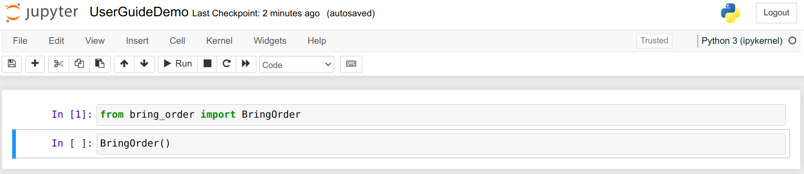


Launching BringOrder first opens an input field for OpenAI API key.
The key is needed if you want to use ChatGPT through BringOrder and have it generate some code for you.
To create a key, go to [OpenAI website](https://platform.openai.com/) and log in or sign up.
Then, click 'Personal' at the top right of the screen and select 'View API keys'.
Finally, click the button `+ Create new secret key`.

When you have your key, you can paste it to the input field and click `Submit key`.
If you don't want to use ChatGPT, you can just click `Skip` instead.

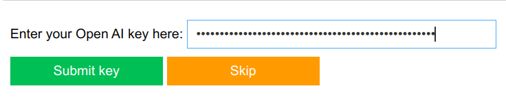

## Data Import

The first step in the analysis is to name your study and describe your data,
so fill in the text fields and click `Save description`.

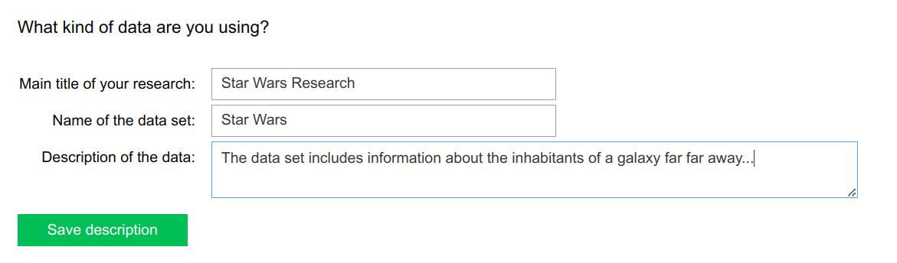

The text will be automatically inserted into a Markdown cell.

The easiest way to import your data is to load it from a csv file.
This can be done by selecting the target file with the file chooser that opens next:

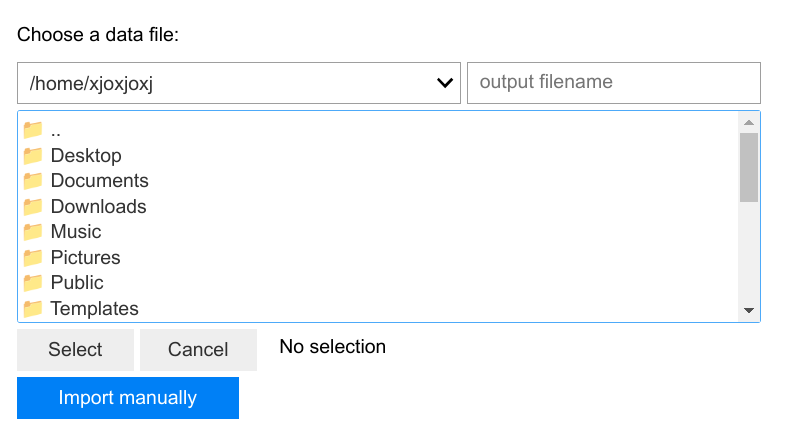

The file chooser opens by clicking `Select`. Find the correct file and click `Select` again.
Check that the selected path is correct and confirm the choice by clicking `Analyze this data`.
After this click, BringOrder moves forward and the file cannot be changed anymore so be careful here!
Also, make sure that you have read access rights to the selected file.

If your data is not in a csv file, you can still use BringOrder but you will have to import the data manually.
Also, some features are disabled if the data is not imported from a csv file.

These features are:
- Automatically checking if the variables are normally distributed
- An option to automatically check if two variables are independent
- Warning about using tests that assume that variables are normally distributed for variables that are not
- Automatically inserting the variable names into your messages to ChatGPT

After choosing a data file to analyze, the data will be stored in a pandas DataFrame called 'df'.
If there are some variables that are not normally distributed, you will be notified about that:

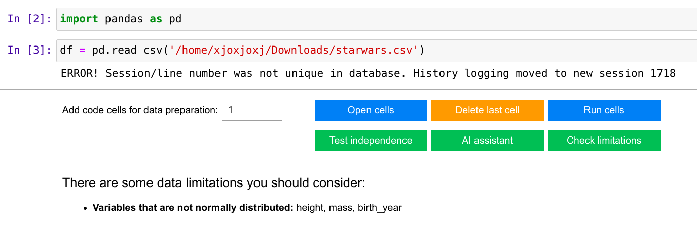

The error message that you can see in the picture is unfortunate but harmless so you can just ignore it.

You have a few options to explore your data further and to prepare the data frame for analysis.
First of all, you can open new code cells and write your own code into them.
If you happen to open too many cells, you can delete them one by one starting from the bottom.
Clicking `Run cells` executes all the code cells that you have opened.

If you wish to test if some variables are independent, you can click `Test independence` which opens this view:

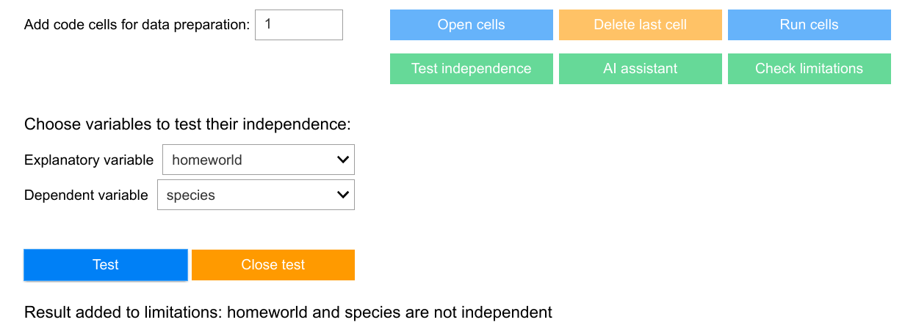

Select the variables you are interested in and click `Test`.
The result will be printed below the buttons as you can see in the picture.
You can do as many tests as you want and when you are done, just click `Close test`.

If you want to request ChatGPT to generate some code for you, click `AI assistant` and you will see this view:

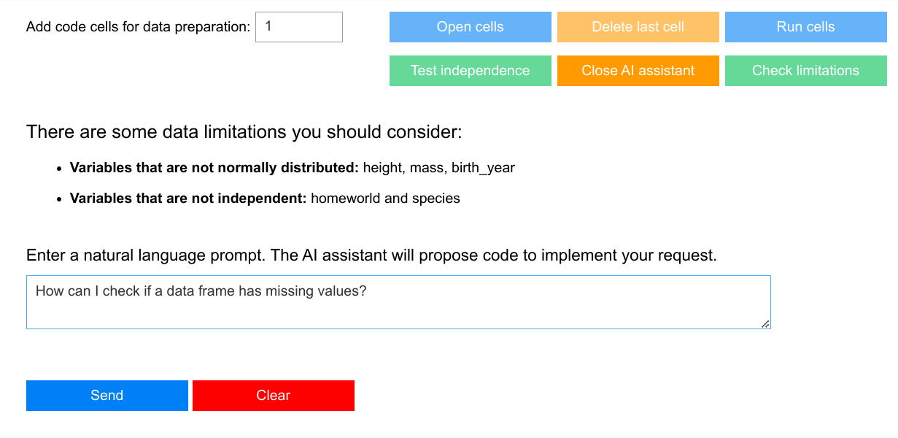

Write your message to ChatGPT and click `Send`.
Getting the response can take some time so be patient.
When the response is ready, all Python code will be automatically extracted from it
and inserted into a code cell but it will not yet be executed.
You should check the code and if you are happy with it, you can click `Close AI assistant` and then `Run cells`.
Here is a piece of AI generated code:

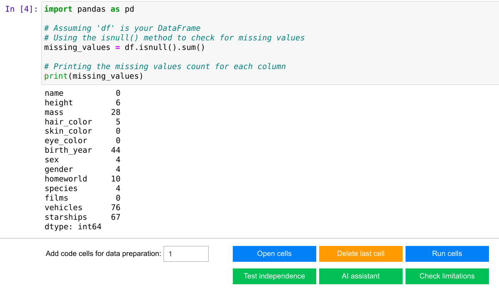

You can also read the complete response by clicking `Show response` when the AI assistant view is open.
The response can be hidden again by clicking `Hide response`.

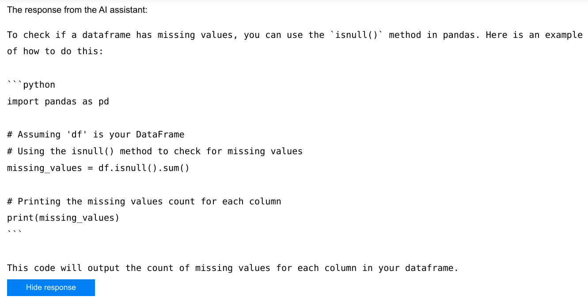

To conclude the data import phase, you should check data limitations by clicking `Check limitations`.
If some limitations have been found in the automated tests, they have been filled in for you:

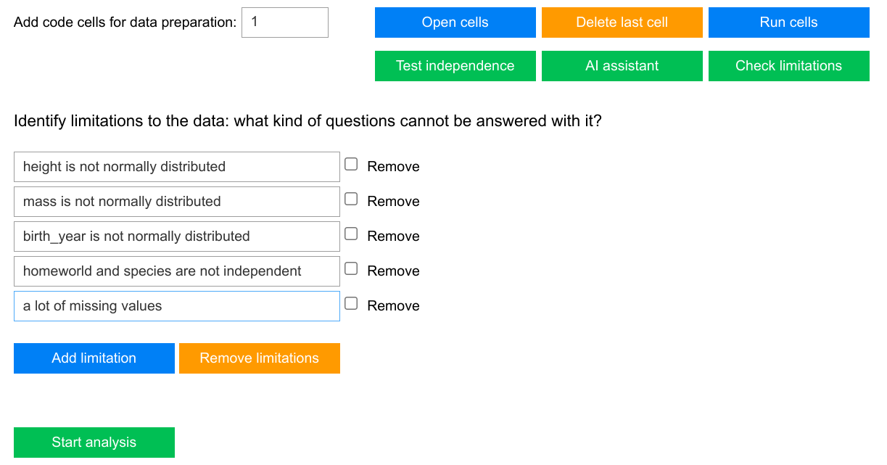

If there are some limitations that do not affect your study, you can remove them by checking the check boxes
next to those limitations and clicking `Remove limitations`.
You can also edit the limitations and add new ones. At least one limitation must be identified.

When you are ready with the limitations, click `Start analysis`.
You will have two options to choose from, either testing a hypothesis or performing some explorative analysis.
So choose your path and click the corresponding button:


## Testing Hypothesis

Testing a hypothesis starts with describing the theory behind your study
and formulating a good hypothesis and null hypothesis:

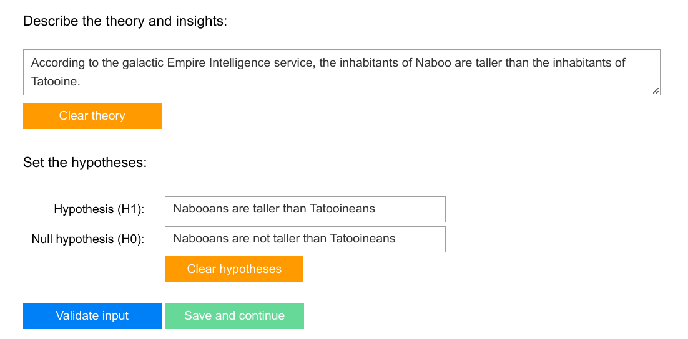

Clicking `Validate input` will run some checks on what you have written and if everything is ok,
you will be taken forward.
If some problems are found, you will see an error message or a warning.
Warnings can be ignored and you can click `Save and continue` to move on
if you think that the warnings are unnecessary.
Errors require you to modify your input before continuing.

Next, you must check that your hypotheses are in line with the data limitations that you found earlier:

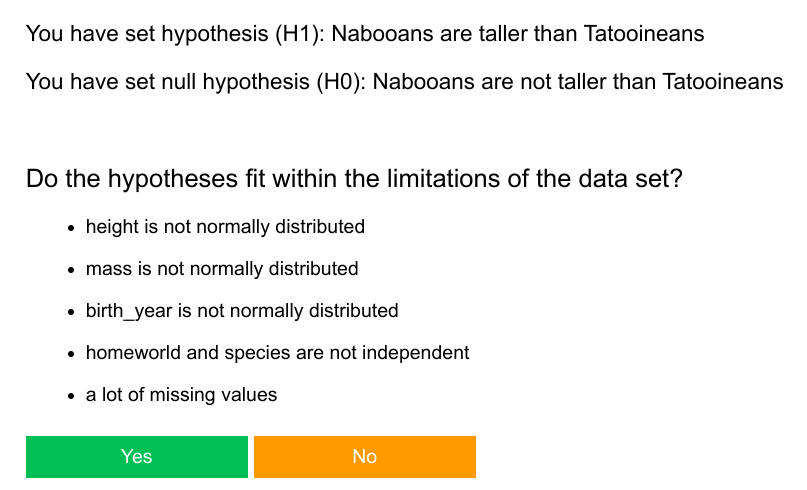

Click `Yes` to continue or `No` to return to setting the hypotheses.

After confirming the hypotheses, you can again open code cells to perform your analysis
and the AI assistant is there to help you (provided that you have given the API key).
You can also delete code cells one by one
or even clear them all but be very careful because this cannot be undone.

Note also that clicking `Run cells` will now disable all other buttons and ask you to draw a conclusion
so you cannot add or remove code cells after that.
(You can modify what's inside the open code cells, though, and execute them again).
If you absolutely want to run some cells before you are ready with your analysis code,
do it by clicking the code cell and pressing Ctrl+Enter.

Clicking `Run cells` will also check your code and warn you if you seem to be performing tests
against the data limitations:

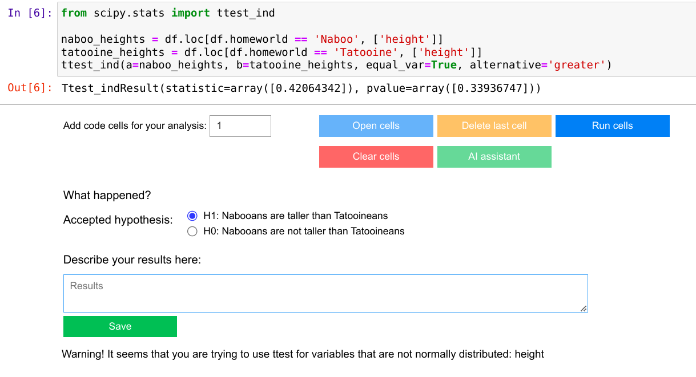

As a default, the checking function is looking for 'ttest' used with variables that are not normally distributed.
The check will only work if the names of the test and the variables are found in the same code cell.
You can add more tests to be monitored with a configuration file,
see instructions in section 'Tips and warnings' below.

If you get a warning, check your code and modify it if necessary, and click `Run cells` again.
When you are done, use the radio buttons to select the hypothesis that was accepted.
You can also write some notes about the results if you want to and then click `Save`.

You will then have three options:
- You can start new analysis (either hypothesis testing or explorative) using the same data
- You can import and prepare new data
- You can continue to closing BringOrder


## Explorative Analysis

Explorative analysis starts with stating your preconceptions.
These are the results that you expect your data to support.
You must fill in at least one preconception but you can add more if you want.
When you are ready to continue, click `Save preconceptions`.

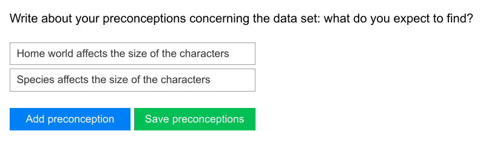

Again, you can open code cells for your analysis and use the AI assistant if you wish.
This time, clicking `Run cells` will temporarily disable all other buttons and ask you to
write about your observations. It will also warn you about tests that don't fit the data limitations
as in hypothesis testing.

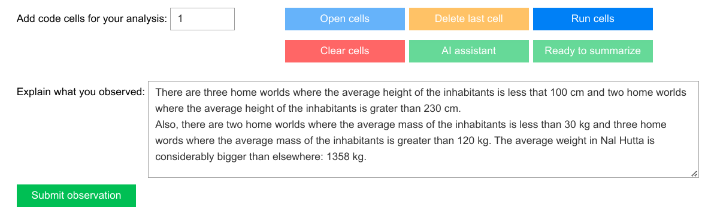

When you click `Submit observation`, you can then open more code cells for analysis or,
if you are done with the analysis, click `Ready to summarize`.

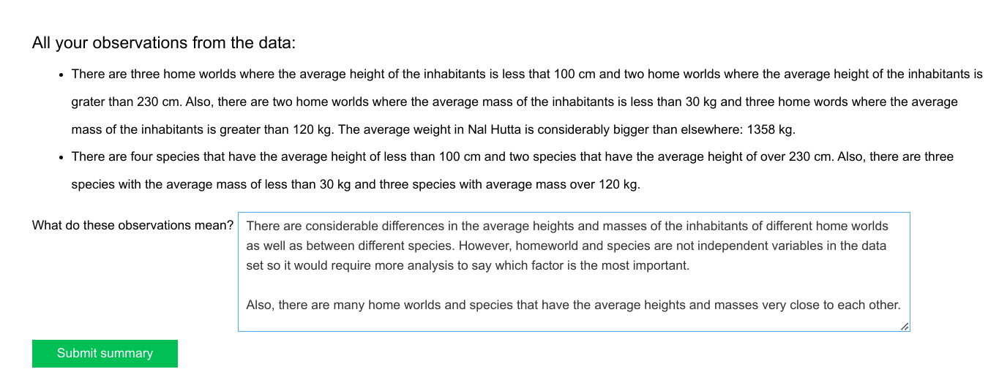

All your observations will be printed for you as a reminder and you can write about your conclusions.
Click `Submit summary` to continue.

The final step in the explorative analysis is evaluating the analysis.
The point is to reflect if you have just found the things that you were looking for
or if something unexpected came up.

You will first see a slider that asks how many percent of the preconceptions were confirmed:

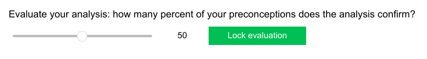

You can determine yourself how to calculate the percentage here, it is about your intuition.
Drag the ball to correct position on the slider and click `Lock evaluation`.

You will then be asked to go through your preconceptions and to check those that you think were confirmed.
After this, you can change your evaluation with another slider if you want to.

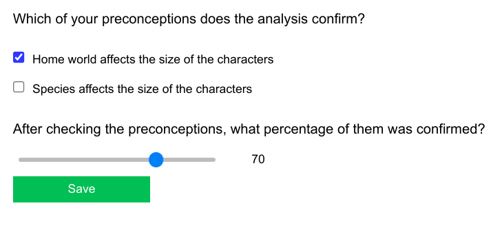

If you change your evaluation significantly, you will also be asked to give an explanation on what made you change it.

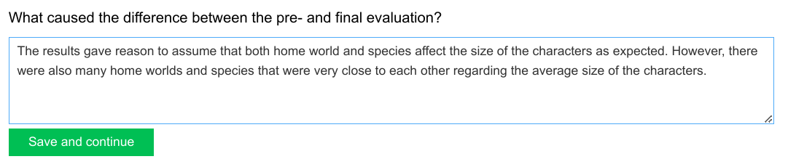

Clicking `Save and continue` ends the explorative analysis and
you will get the same three options as after hypothesis testing:
starting new analysis, importing new data, or continuing to close BringOrder.

## Closing BringOrder

The closing phase starts when you click `All done` after an analysis.

While you are working with BringOrder, it automatically creates a PowerPoint presentation and
fills it with the texts that you give as input. You can now choose to save that file by clicking `Save`
or to delete it by clicking `Cancel`. If you save the presentation, you will find it in the same directory
as the notebook you are working on. The name will be the same as the title of your research.

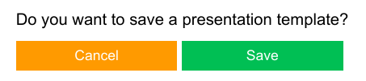

Finally, you have the option of saving the whole notebook as a pdf file.


If you don't need the pdf, click `Close BringOrder` and you are done.
If you wish to create the pdf file, choose `Export to pdf`.
This will open a view where you can change the settings and see a preview before saving.

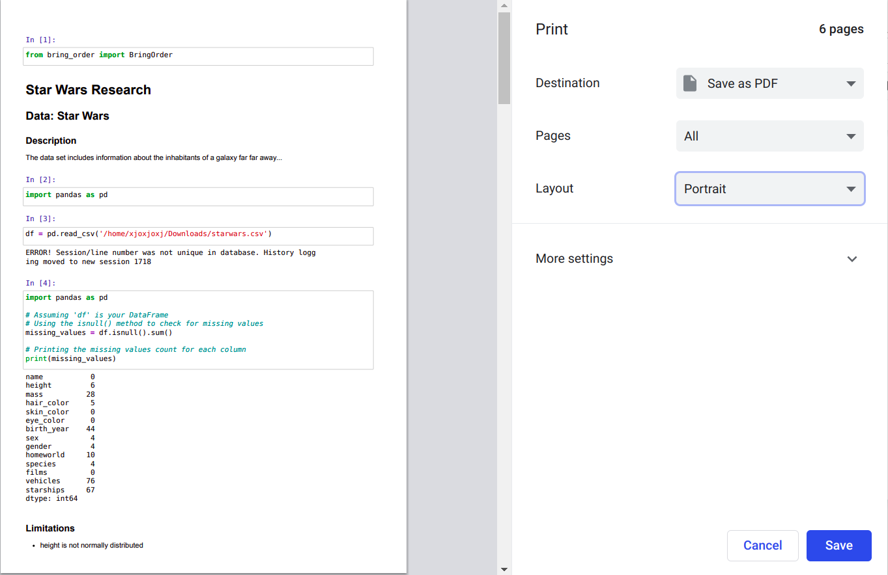

When you are happy with the settings, click `Save`, choose location, and name the pdf.
Click `Save` again and you are done.

## Tips and Warnings

1. Before launching BringOrder, make sure that the notebook is in 'Trusted' state.
   If it is not, the widgets might not show properly.
   
2. Never close the notebook while BringOrder is running if you are not done with the analysis.
   The markdown texts and code that you have written will be saved but the widget state is not,
   so you won't be able to continue where you left off.
   
3. Only use the BringOrder buttons to open and remove code cells.
   If you use Jupyter Notebook's buttons, other BringOrder buttons may not do what they are supposed to do.
   
4. If you wish to add more tests to be monitored and have BringOrder warn you of using them
   with variables that are not normally distributed, you can write the test names into a configuration file
   called 'bringorder.cfg'. Put the configuration file into the same directory where you have the csv data file
   so that BringOrder can find it. The file should have one test name per row.
   See a model file [here](https://github.com/Order-Team/bring-order/blob/main/tests/test_files/bringorder.cfg).

5. You must have read access rights to your selected data csv file as well as to the possible configuration file.
   If you don't, BringOrder will fail with an error.

6. The whole BringOrder workflow is code running in in the cell where you first call `BringOrder()` Make sure you don't accidentally remove that cell or try to run it again during the workflow or you will have to start from the beginning.

7. Before clicking `Export to pdf`, it's a good idea to skim through the notebook and check that you are happy with the texts saved in the Markdown cells. If not, feel free to modify them.

8. **IMPORTANT! Your OpenAI API key and messages to ChatGPT are not encrypted by BringOrder before sending them forward. If you use the AI assistant, you must acknowledge this issue.** Otherwise, you can use BringOrder without the AI assistant feature.


